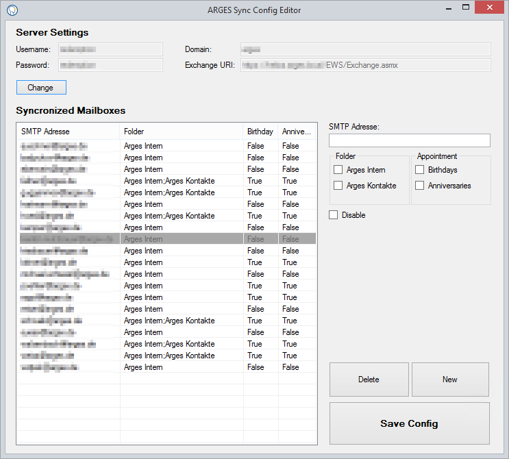

# ArgSync

The program synchronizes public contact folders of the Exchange server with the mailboxes that are registered in the config. It also carries the Birthdays and Anniversaries of Sync Contacts into the calendar.

## Getting Started

These instructions will get you a copy of the project up and running on your local machine for development and testing purposes. See deployment for notes on how to deploy the project on a live system.

### Prerequisites

What things you need to install the software and how to install them

```
Exchange Server
An AD user who owns the impersonating role
```

### Installing

A step by step series of examples that tell you how to get a development env running

Install the program on a server that has access to the Exchange. The best is a domain controller.
Configure your Exchange connection via the Config Editor.



## Deployment

Create a task in the Windows Task Scheduler which starts the Redemption.exe cyclically.

## Built With

* [Visual Stuio 2017](https://visualstudio.microsoft.com/de/)
* [Exchange EWS](https://docs.microsoft.com/en-us/exchange/client-developer/exchange-web-services/explore-the-ews-managed-api-ews-and-web-services-in-exchange)

## Versioning

We use [SemVer](http://semver.org/) for versioning. For the versions available, see the [tags on this repository](https://github.com/Obilarius/Arges_ArgSync/tags). 

## Authors

* **Sascha Walzenbach** - *Initial work* - [Obilarius](https://github.com/Obilarius)

See also the list of [contributors](https://github.com/Obilarius/Arges_ArgSync/contributors) who participated in this project.

## License

This project is licensed under the MIT License - see the [LICENSE.md](LICENSE.md) file for details
